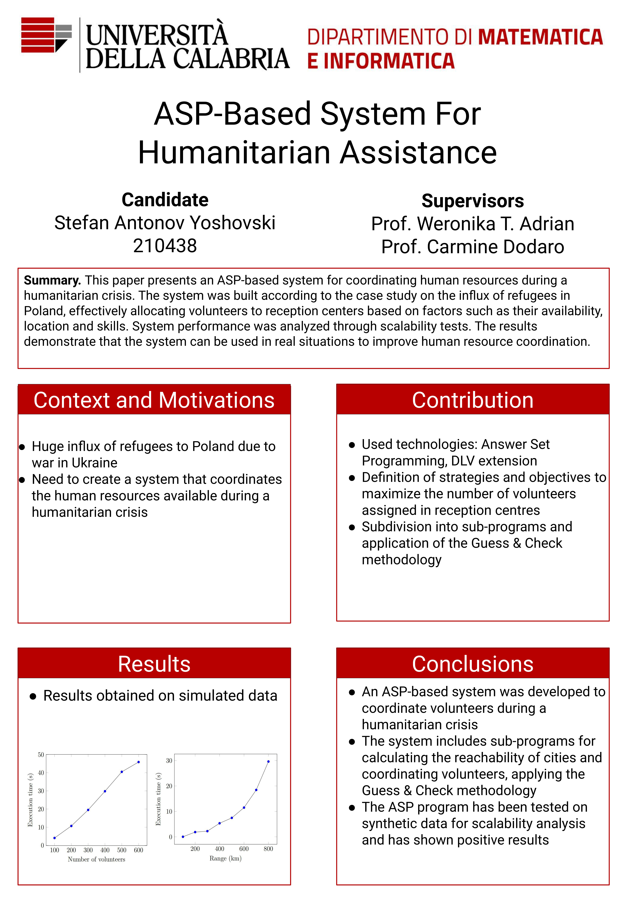

# ASP-Based System For Humanitarian Assistance

Bachelor's Degree in Computer Science at University of Calabria, Italy

- **Type of Thesis**: Research with actual working developed ASP (Answer Set Programming) based system
- **Case Study**: ASP-based system for optimizing volunteer distribution during a refugee crisis caused by the Russian invasion of Ukraine in Poland
- **Thesis Research and Development Locations**: University of Science and Technology (Cracow, Poland) and University of Calabria (Rende, Italy)
- **Author**: [Stefan Yoshovski](https://www.linkedin.com/in/stefan-yoshovski/?locale=en_US)
- **Supervisors**: Prof. Weronika Teresa Adrian, Prof. Carmine Dodaro

### Table of Contents

1. [Overview](#overview)
2. [Thesis Research and Development](#thesis-research-and-development)
3. [Materials](#materials)
4. [How to run the ASP-Encoding?](#how-to-run-the-asp-encoding)

### Overview
This thesis examines the impact of the Russian invasion of Ukraine on the influx of refugees into Poland, analyzing the number of refugees and its effects on the region. Additionally, the study presents an ASP-based system for coordinating human resources during a humanitarian crisis. The system was built according to a case study on the refugee influx in Poland and effectively allocates volunteers to reception centers based on factors such as availability, location, and skills. The system addresses a complex combination of workforce management and the Traveling Salesman Problem, utilizing innovative programming methodologies to design an efficient algorithm that provides a solution to the problem at hand. System performance was analyzed through scalability tests, demonstrating that the system can be utilized in real-life situations to improve human resource coordination. This study aims to contribute to the growing body of research on the use of Artificial Intelligence in humanitarian crises and provide insights for future work in this area.

### Thesis Research and Development
The research and development of this thesis was conducted in two parts:
- **Krakow, Poland (University of Science and Technology)**: The thesis research was conducted at the University of Science and Technology in Krakow. Being in Poland during the Russian invasion of Ukraine, I experienced firsthand the impact on the influx of refugees into the country. I gathered data through interviews and research, analyzing the situation to develop a solution.

- **Rende, Italy (University of Calabria)**: The ASP-encoding and data testing of the thesis were conducted at the University of Calabria in Italy. This is where the ASP-based system was developed and refined for accuracy and efficiency.

### Materials

- [Thesis Poster Presentation](./Resources/Graphs_and_Data/Poster_Presentation.pdf)
- [Complete Thesis](./Resources/Graphs_and_Data/ASP_based_system_for_humanitarian_assistance.pdf)

### How to run the ASP-Encoding?
- You will need an Answer Set Programmin Solver. For this particular work, it was used [DLV2 System](https://dlv.demacs.unical.it/), version 2.1 (no support to python required)
- In the ASP-Encoding folder in this repository, there are DataTest.dlv files and the files containing the rules. All rules are explained in the [Complete Thesis](./Resources/Graphs_and_Data/ASP_based_system_for_humanitarian_assistance.pdf). Files DataTest.dlv already include the needed data for testing. If you want to test different amount of data, simply comment (using the symbol %) the rows of data you don't need. If you want to test different data, there is an [Excel File](./Resources/Data_Randomizer/randomData.xlsb.xlsx) for generating new data based on Real Statistics, by using distribution in classes with different frequencies.
- To actually run the system, you can use Visual Studio Code with the following extension: [ASP Language Support for DLV2 System](https://marketplace.visualstudio.com/items?itemName=RiccardoCarnevali.asp-language-support-dlv2) or by downloading [DLV2 System](https://dlv.demacs.unical.it/) on Linux/Windows Enviroement without the need of an IDE. The simplest way is to use Visual Studio Code + the extension. Tutorials on how to connect different files for execution are shown inside the extension. I am not responsible for any deprecated systems or extension that may occur in the future. And to run your tests, you can use any Answer Set Programming Solver.
- To Measure the execution on windows, you can use the [Measure-Command{<program>}](https://learn.microsoft.com/en-us/powershell/module/microsoft.powershell.utility/measure-command?view=powershell-7.3)
- First execute the [Reachability_of_Cities_Within_a_Distance_Range](./ASP_Encoding/Reachability_of_Cities_Within_a_Distance_Range) encode. Then use its output as an input to the main encode [Coordination_of_Volunteers](./ASP_Encoding/Coordination_of_Volunteers). The main encode can also run alone. In fact the atoms given in output from Reachability_of_Cities_Within_a_Distance_Range encode, will slow down the system significantly.
- To connect the encoding to a graphical user interface (GUI), you can use a programming language or a software development tool that supports the integration of ASP with GUI components (e.g. [EmbASP Framework](https://www.mat.unical.it/calimeri/projects/embasp/) or [ASPIDE](https://www.mat.unical.it/ricca/aspide/).

